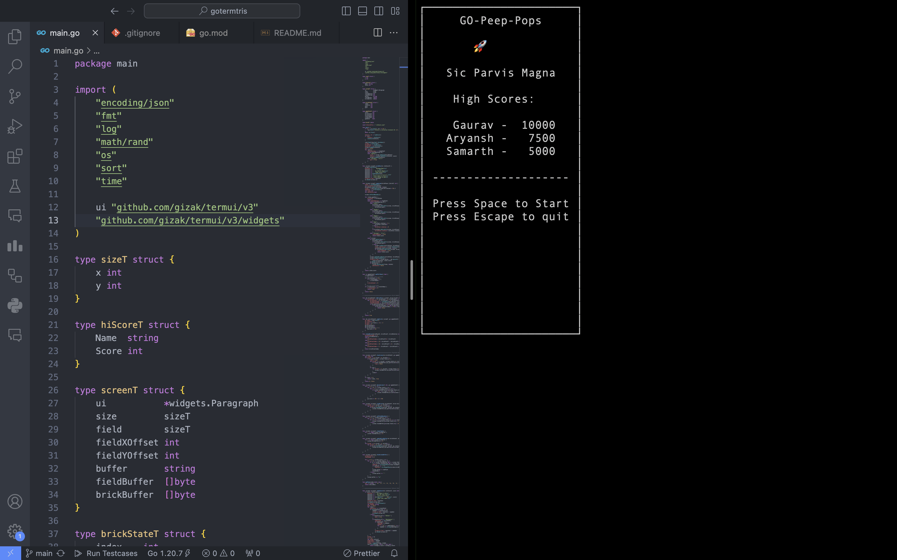
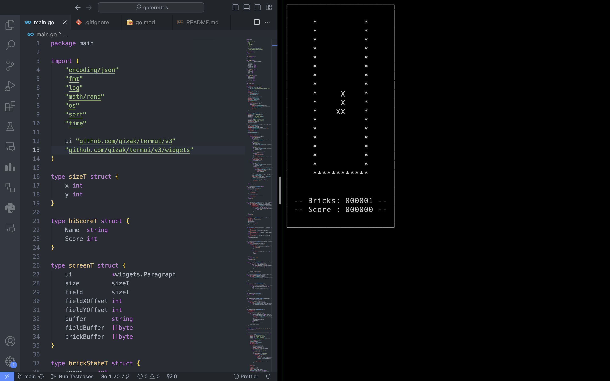

# Leave me Alone !!!

 
 @javidx9 
 He Helped me to Understand the Game logic and the basics of the game. Here's his video on tetris in c++
 https://youtu.be/8OK8_tHeCIA?si=7DRu3aT7H5EXQUWN

https://github.com/EuclidStellar/Go-Peep-pop/assets/100860877/d4fb7825-a0b7-4d86-98c2-3ed0c8276d9d

<!-- 
Some Nomad

Oh, love of mine

With a song and a whine

You're harsh and divine

Like truths and a lie

But the tale ends not here

I have nothing to fear

For my love is yell of giving and hold on

And the bright emptiness

In a room full of it

Is a cruel mistress

Whoa oh!

I feel this unrest

That nests all hollowness

For I have nowhere to go and I'm cold.

And I feel so lonely yeah...

There's a better place than this

Emptiness

Uploading screen2.mov…

And I'm so lonely yeah...

There's a better place than this

Emptiness, yeah!

 

 

 
  

  -->
